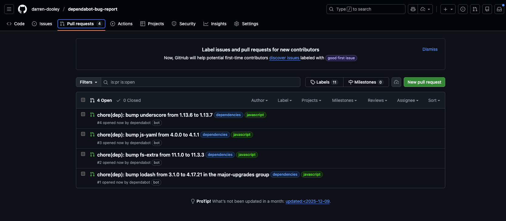

### Repository to Demo a bug with Dependabot groups
* Find the issue on the dependabot-core project: https://github.com/dependabot/dependabot-core/issues/13919

**Description**
I have defined two groups in my dependabot.yml file: `major-upgrades` and `minor-upgrades`.

However, Dependabot is not grouping the updates that belong to the `minor-upgrades` group, as expected. It is creating a separate PR for each individual update. On the other hand, a PR is correctly created for the `major-upgrades` group.

The screenshot below shows that Dependabot created a single PR for the `major-upgrades` group, as expected, but it created separate pull requests for each minor/patch upgrade.



Removing the `patterns` key from the group resolved the issue.

**Steps to reproduce:**

1. Fork this repository
2. Open the `Actions` tab on your forked version
3. Verify Dependabot has started its update
4. Open the Dependabot update job and read the logs
5. Search for the following snippet in the logs: 
```
2026/01/09 17:51:39 WARN <job_1205057440> Please check your configuration as there are groups where no dependencies match:
- minor-upgrades
- patch-upgrades

This can happen if:
- the group's 'pattern' rules are misspelled
- your configuration's 'allow' rules do not permit any of the dependencies that match the group
- the dependencies that match the group rules have been removed from your project
```
6. Open the Pull Requests and observe that Dependabot did not create a PR for the `minor-upgrades` group.
7. Remove the `patterns` key from the groups and push up your changes to trigger another Dependabot run. Observe that PRs were correctly created for both groups.

**Workarounds**

I found two potential workaround but there may be more.

1. You can remove the minor-upgrades group and instead consolidate all major, minor and patch upgrades into a single group.
2. You can remove the `patterns` key from the group.

**Notes**

* I have not tested patterns that do not contain wildcards.
* I have not tested a group that contains only a `patterns` key.
* Similar issue reported here: https://github.com/dependabot/dependabot-core/issues/13154

